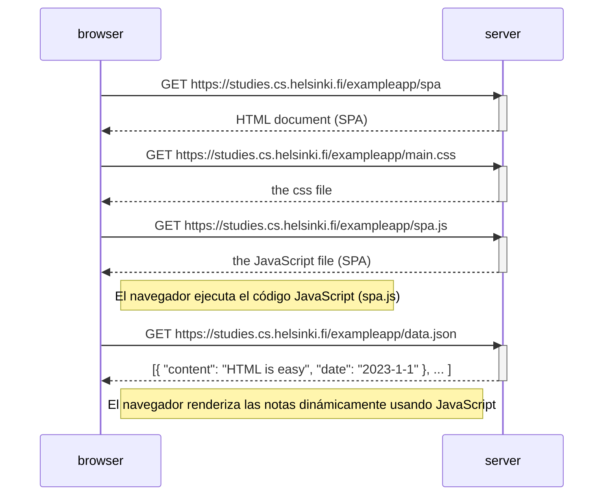

```markdown
# Ejercicio 0.5: Diagrama de aplicación de una sola página

## Descripción
Este diagrama describe la secuencia de eventos cuando un usuario accede a la versión de **Single Page Application (SPA)** de la aplicación de notas. En una SPA, la página no se recarga completamente; en su lugar, el navegador carga una única página HTML inicial y utiliza JavaScript para actualizar dinámicamente el contenido.

## Diagrama de secuencia
