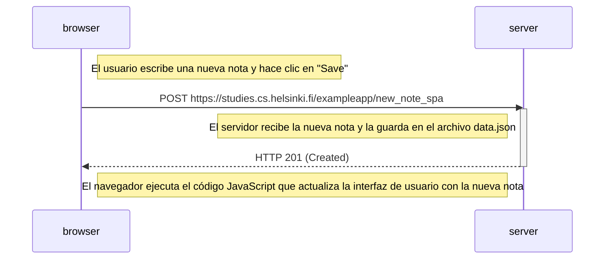

```markdown
# Ejercicio 0.6: Nueva nota en diagrama de aplicación de una sola página

## Descripción
Este diagrama representa la secuencia de eventos cuando un usuario crea una nueva nota en la versión de **Single Page Application (SPA)** de la aplicación. A diferencia de la versión tradicional, no hay redirección ni recarga de la página. El navegador actualiza la interfaz de usuario dinámicamente usando JavaScript.

## Diagrama de secuencia
